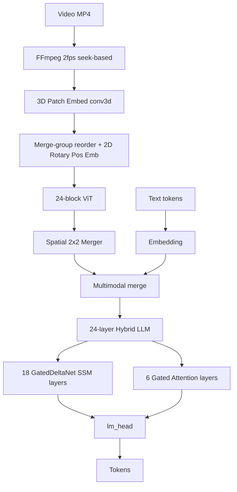
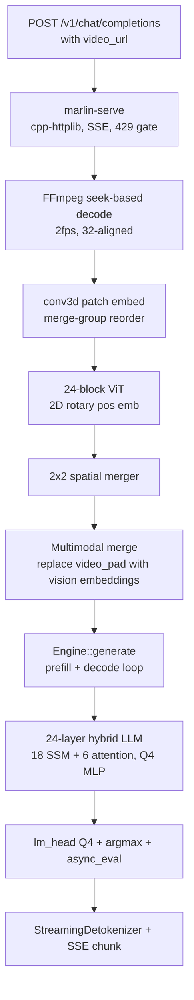

# marlin-mlx

A C++ inference engine for [NemoStation/Marlin-2B](https://huggingface.co/NemoStation/Marlin-2B) on Apple Silicon. Video in, structured captions out, no Python in the runtime. Includes an OpenAI-compatible streaming server with `video_url` support.

The interesting part is not the server. It is what I found when I opened up the model, and what I found when I tested it on real video. The Hugging Face card says "a fine-tune of Qwen3.5-2B." That does not tell you enough to implement it. And my initial benchmark (35.7 tok/s on synthetic video, 1.89x Python) hid three vision pipeline bugs that only showed up on real video. Fixing those cost 12% throughput and taught me more than the optimisation did. [RESEARCH.md](RESEARCH.md) documents the full forensic process.

**Status:** 0.3.0 · MIT · Apple Silicon arm64 only · macOS 26+ · CMake 3.24+

## Why this exists

After building [qwen3-mlx](../inference/) for Qwen3-4B, I wanted to know what changes when the model is multimodal and the architecture is not a pure transformer. Marlin-2B is both: it takes video frames as input, and 18 of its 24 layers are GatedDeltaNet (a recurrent SSM) rather than attention. The bandwidth profile, the dispatch patterns, and the quantisation constraints are all different from the text-only case.

What I did not expect was that the hardest part would not be the LLM or the optimisation. It would be the vision pipeline: getting the right frames, in the right order, with the right position encoding, so the ViT produces embeddings the LLM can actually use.

## Performance

M3 Max, Marlin-2B Q4 MLP+lm_head, greedy temp=0:

**Synthetic corpus (448x448, solid colours):**

| Engine | tok/s | vs Python |
|---|---|---|
| Python HuggingFace (bf16, torch fallback) | 18.85 | 1.00x |
| C++ MLX (Q4 MLP + lm_head, pre-vision-fix) | 35.7 | 1.89x |
| **C++ MLX (Q4 MLP + lm_head, correct vision)** | **31.3** | **1.66x** |

**CaReBench real-world video (1280x720):**

| Video | tok/s |
|---|---|
| Eyebrow tutorial (v_00000030_5) | 13.6 |
| Javelin throw (v_00008674_0) | 27.3 |
| Track and field (v_00008693_0) | 34.5 |
| Javelin throw 2 (v_00008754_0) | 14.3 |
| **Mean** | **19.4** |

The 35.7 to 31.3 drop is the cost of correctness. The original 35.7 number was measured on synthetic 448x448 videos that happened to work despite three bugs in the vision pipeline. Real video at native resolution exposed all three. The current 31.3 is the honest number with correct output on both synthetic and real video.

## What Marlin-2B actually is

The HF card says it is a Qwen3.5-2B fine-tune with the vision tower intact. Here is what it does not say.

### The architecture

Three subsystems, not one:



The layer pattern repeats 6 times: `[SSM, SSM, SSM, Attention]`. The config calls the SSM layers `linear_attention`, which is misleading. They are GatedDeltaNet, a gated delta rule recurrence with causal conv1d, not linear attention in the Katharopoulos sense.

### Where the bytes go

I measured this from the safetensors headers. Every decode step reads these weights:

| Component | MB/token | % of decode bandwidth |
|---|---|---|
| MLP (24 layers, SwiGLU) | 1,812 | 48% |
| lm_head (tied embedding, 248K vocab) | 1,017 | 27% |
| SSM layers (18 GatedDeltaNet) | 758 | 20% |
| Attention layers (6 gated GQA) | 176 | 5% |
| **Total** | **3,764** | |

The vision encoder (662 MB) is read once during prefill, not during decode.

### Things I learned the hard way

These are the details that cost me time because the HF card does not mention them.

**1. The norm weights lie.** Qwen3.5 stores RMS norm weights as an offset from 1.0. The actual multiplier is `(1 + weight)`. The stored values have mean ~0.1. Without the +1 correction, all norm outputs are 6x too small and the model produces garbage. This applies to every norm in the model *except* the `RMSNormGated` inside the SSM layers, which uses standard `torch.ones` initialisation and does not need the offset.

I found this by comparing the norm output at layer 0 between Python and C++. Python std was 1.12, mine was 0.18. The ratio is roughly `1 / (1 + 0.096)` which is what happens when you multiply by 0.096 (the stored weight mean) instead of 1.096.

**2. The q_proj is double-width.** The 6 attention layers use `attn_output_gate=true`. The `q_proj` weight is `[4096, 2048]`, not `[2048, 2048]`. It contains both the query and an output gate, interleaved per-head. You have to reshape to `[B, S, num_heads, 2 * head_dim]` *before* splitting in half. If you split the flat 4096 dim in half you get `[2048]` + `[2048]` which silently mixes query values from one head with gate values from another.

**3. The patch embed is 3D.** The ViT uses `conv3d`, not `conv2d`. Weight shape is `[1024, 3, 2, 16, 16]` -- the temporal_patch_size=2 groups pairs of frames before spatial patching. The safetensors stores PyTorch layout `[C_out, C_in, D, H, W]`; MLX conv3d expects `[C_out, D, H, W, C_in]`.

**4. The conv1d is depthwise.** The SSM causal conv1d weight is `[6144, 1, 4]` -- depthwise with groups=6144. Both PyTorch and MLX need different axis orderings, and the single-step decode path (sliding window) and the prefill path (full conv1d) handle it differently.

**5. Vision tokens have structure.** A 10-second video at 2fps does not produce one flat sequence of vision tokens. It produces 10 temporal groups, each wrapped in `<|vision_start|>...<|vision_end|>` with 196 `<|video_pad|>` tokens (14x14 after 2x2 spatial merge of 28x28 patches). Total: 1,960 vision tokens + ~63 text tokens = ~2,023 prompt tokens.

**6. The SSM state cannot be trimmed.** Each GatedDeltaNet layer maintains a recurrent state `[1, 16, 128, 128]` in float32. This is 512 KB per layer, 9 MB total, tiny compared to a KV cache. But you cannot trim it at arbitrary token boundaries the way you can slice a KV cache. This breaks prefix cache reuse and speculative decoding.

**7. The ViT needs 2D rotary position encoding and merge-group patch ordering.** This is the one the synthetic benchmark hid from me. The HF processor flattens video patches in 2x2 spatial merge groups, not row-major. And the ViT attention blocks use 2D rotary position embeddings (row + column frequencies) to encode spatial location. Without both of these, the ViT cannot distinguish spatial layout on non-uniform content. My synthetic test corpus (solid colour blocks at 448x448) produced correct output without either, because uniform content has no spatial structure to get wrong. Real video at 1280x720 produced "grids of tan-colored cubes" until I added the rotary encoding and fixed the patch ordering.

**8. Frame decoding is not interchangeable.** FFmpeg's `fps=2` filter and torchcodec's uniform sampling produce different frames from the same video. The model is sensitive to the exact frames: same spatial position, different pixel content. I had to switch from the `fps` filter to per-frame seeking at explicit timestamps (0.0s, 0.5s, 1.0s, ...) to match torchcodec's behaviour.

### The GatedDeltaNet recurrence

This is the core compute that makes it not-a-transformer. Per token, per SSM layer:

```
state *= exp(-exp(A_log) * softplus(a + dt_bias))   -- decay
kv_mem = sum(state * k, dim=Dk)                      -- read from state
delta  = (v - kv_mem) * sigmoid(b)                   -- delta rule
state += outer(k, delta)                             -- write to state
output = sum(state * q, dim=Dk)                      -- query the state
```

Followed by `RMSNormGated(output, silu(z))` and an out_proj matmul. The recurrence itself is ~36 elementwise ops that I tried to fuse via `mx::compile`. It made no measurable difference because the quantised matmuls dominate decode time, not the elementwise ops between them.

## Build

```bash
cmake -B build
cmake --build build -j
```

MLX 0.25.2 via FetchContent. First build compiles MLX from source (~5-8 min). FFmpeg required (`brew install ffmpeg`).

## Binaries

| Binary | Purpose |
|---|---|
| `marlin-serve` | OpenAI-compatible HTTP+SSE server with `video_url` |
| `marlin-caption` | CLI: `marlin-caption <model> <video> [event]` |
| `marlin-bench` | Benchmark harness (stub) |

## Run

**Serve:**

```bash
./build/marlin-serve marlin-2b-ref --port 8080
```

```python
from openai import OpenAI
client = OpenAI(base_url="http://localhost:8080/v1", api_key="x")
for chunk in client.chat.completions.create(
    model="marlin-2b",
    messages=[{"role": "user", "content": [
        {"type": "video_url", "video_url": {"url": "file:///path/to/video.mp4"}},
        {"type": "text", "text": "Describe this video"},
    ]}],
    stream=True,
):
    print(chunk.choices[0].delta.content or "", end="", flush=True)
```

The `video_url` content type matches vLLM, SGLang, and LMDeploy.

**Caption** (no HTTP):

```bash
./build/marlin-caption marlin-2b-ref video.mp4
./build/marlin-caption marlin-2b-ref video.mp4 "a person enters the room"
```

Weights: `huggingface-cli download NemoStation/Marlin-2B --local-dir marlin-2b-ref`. Gated model, requires HF login. On first run the engine quantises MLP and lm_head projections to Q4_g64 (~2s).

## How it works



## Known limitations

The SSM prefill is sequential by definition. Prefill for a 30-second video (1,960 vision tokens) takes ~7 seconds. A chunked-parallel approach (FLA's `chunk_gated_delta_rule`) would help but requires a different kernel.

The ViT prefill scales with frame resolution. CaReBench videos at 1280x720 produce 3,520 spatial patches per temporal group (vs 784 for 448x448), which increases ViT prefill time roughly 4x. This is the main reason CaReBench tok/s (19.4 mean) is lower than synthetic tok/s (31.3 mean).

The bilinear position embedding interpolation used by the Python model is not yet implemented. The current engine uses only rotary position embeddings for the ViT.

## Licence

MIT. See [LICENSE](LICENSE).

This project dynamically links FFmpeg (libavformat, libavcodec, libswscale, libavutil). FFmpeg is LGPL 2.1+ by default. If your FFmpeg was compiled with `--enable-gpl` (for x264/x265 support), linking it makes your combined binary GPL. The Homebrew FFmpeg build is LGPL by default. All other dependencies (MLX, nlohmann/json, fmt, cpp-httplib, tokenizers-cpp) are MIT or Apache 2.0.
